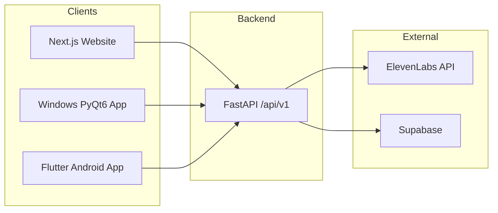
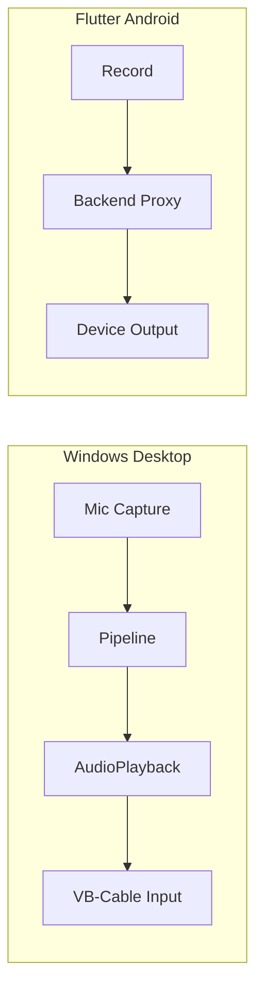

# Mobile UI, Flutter Android App, Virtual-Mic Output, and Testing Strategy

## Current state

- **Desktop app**: [live-dubbing/](live-dubbing/) — Windows-only PyQt6 app; mic translate already plays translated audio to **CABLE Input** (VB-Cable) so other apps see it as virtual mic ([mic_translator.py](live-dubbing/src/live_dubbing/core/mic_translator.py), [mic_translate_panel.py](live-dubbing/src/live_dubbing/gui/widgets/mic_translate_panel.py)).
- **Website**: [website/](website/) — Next.js 16 + Tailwind; some responsive classes (`md:`, `sm:`) but no explicit viewport in [layout.tsx](website/src/app/layout.tsx); no dedicated mobile layout.
- **Backend**: [backend/](backend/) — FastAPI at `/api/v1` with auth, user, proxy (ElevenLabs), billing; CORS configurable; no Flutter/mobile client today.
- **Tests**: live-dubbing has unit tests only ([tests/](live-dubbing/tests/) — VAD, settings, languages); no integration/E2E or multi-platform strategy.

---

## 1. Design UI for mobile

**Website (Next.js)**  

- Add explicit viewport (and optional themeColor) in [website/src/app/layout.tsx](website/src/app/layout.tsx) via Next.js `metadata.viewport` (or a root `<head>` viewport meta) so mobile browsers scale correctly.  
- Audit key pages (home, download, pricing, login, dashboard) for touch targets, font sizes, and layout on small viewports; use Tailwind breakpoints (`sm`, `md`, `lg`) and mobile-first patterns where needed.  
- Ensure [navbar](website/src/components/navbar.tsx) and [footer](website/src/components/footer.tsx) are usable on narrow screens (hamburger/drawer if needed, stacked links).  
- No new framework: keep Next.js + Tailwind; improve responsive rules and add viewport meta.

**Flutter app (new)**  

- New Flutter project will have a **mobile-first UI** by default (see section 2). Screens will be designed for phones first; tablet/desktop can be addressed later with responsive layouts if desired.

---

## 2. Flutter app for Android / Play Store

**Scope**  

- Add a **new Flutter project** (e.g. `mobile/` or `app/` at repo root) for the Live Translate mobile client.  
- Target **Android** first (Play Store); iOS can be added later with the same codebase.  
- **Android permissions**: Declare `RECORD_AUDIO` and `INTERNET` in AndroidManifest.xml. Implement runtime permission checks for the microphone (e.g. using `permission_handler`): request RECORD_AUDIO in the mic translate flow (MicTranslateScreen / micStart handler or a PermissionService), show a rationale dialog on denial, handle permanent denial by linking to app settings, and gracefully disable or fallback the mic (e.g. disable start button and show instructions) when permission is not granted. Never attempt recording or backend proxy calls (transcribe → translate → synthesize) without granted permissions. Document these requirements in this plan and in the app README.
- The app will consume the **existing backend** ([backend/app/](backend/)): auth (login/register/refresh, optional OAuth), user/usage, proxy (transcribe, synthesize, translate, voices). No rewrite of backend; ensure CORS and auth (e.g. Bearer JWT) work for a mobile client.

**Flutter app architecture (high level)**  

- **State management**: Use a single approach (e.g. Riverpod or Provider). Main units: **Auth** (AuthNotifier/AuthProvider for tokens and login/logout), **API client** (injected via Provider/Riverpod with interceptors), **Translate flow** (TranslateController/TranslateNotifier for mic capture, transcription, translation, synthesis, playback state), **Settings** (SettingsNotifier for language/voice/output persistence), **Audio** (AudioPlayerService as singleton/Provider). Test via unit tests for notifiers/controllers and integration/widget tests for UI flows. Wire DI at app root (e.g. ProviderScope/MultiProvider). The sections below (Auth, API client, Mic translate flow, Audio, UI) reference these providers/notifiers.
- **Auth**: Call `POST /api/v1/auth/login` (and register/refresh); store tokens securely (e.g. `flutter_secure_storage`).  
- **API client**: Dart HTTP client (e.g. `dio` or `http`) with base URL from config, interceptors for auth and error handling.  
- **Features (MVP)**:  
  - Login/settings (language, voice, output).  
  - **Mic translate flow**: Device mic → capture (e.g. `record` or `sound_stream`) → send to backend proxy (transcribe → translate → synthesize) → play translated audio to **device output** (speaker/earpiece).
- **Audio**: Use `record` (or similar) for capture; use `just_audio` / `audioplayers` or platform channels for playback.  
- **UI**: Material 3, mobile-first; screens: login, home (start/stop translate), settings, usage/billing if needed.

**“Virtual mic” / soundboard behavior**  

- **Windows (existing)**: Keep current behavior: translated audio is played to **CABLE Input** so other apps (Discord, Zoom) receive it as microphone input. Optionally make this more explicit in the desktop UI (e.g. “Play to virtual mic (CABLE Input)” in [mic_translate_panel.py](live-dubbing/src/live_dubbing/gui/widgets/mic_translate_panel.py)).  
- **Android (Flutter app)**: Android does not expose a system-level “app as virtual microphone” like VB-Cable. Translated audio will be played to the **device’s audio output** (speaker/earpiece). Other apps on the same device generally cannot use this as their “microphone” input without system or third-party routing. Plan: document this in-app (e.g. “Translated audio plays through your device speaker”) and do not promise Discord/Zoom “virtual mic” on Android unless you later integrate a specific solution (e.g. guiding users to use the phone as a remote mic via a companion desktop app).

**Deliverables**  

- New Flutter project with Android build, login, mic capture, backend proxy calls, TTS playback.  
- CI (e.g. GitHub Actions) to build Android APK/app bundle.  
- Optional: document in README or in-app that “virtual mic” for other apps is a Windows (VB-Cable) feature.

---

## 3. Microphone module: play translated audio as “audio input” (soundboard-style)

**Windows (live-dubbing)**  

- Already implemented: [MicTranslator](live-dubbing/src/live_dubbing/core/mic_translator.py) plays TTS output to `AudioPlayback` with `output_device_id` set to **CABLE Input** (VB-Cable), so other apps see it as mic input.  
- **Optional improvements**:  
  - In [mic_translate_panel.py](live-dubbing/src/live_dubbing/gui/widgets/mic_translate_panel.py), default or prominently suggest “CABLE Input” as the output device and add short tooltip/text: “Plays as virtual microphone for other apps (e.g. Discord, Zoom).”  
  - Ensure [get_output_devices](live-dubbing/src/live_dubbing/audio/playback.py) continues to list VB-Cable so “CABLE Input” is selectable.

**Flutter (Android)**  

- “Soundboard-style” on device = play translated audio to the **default audio output**. Implement in Flutter: after receiving TTS bytes from the backend proxy, play them through the chosen output (speaker/earpiece). No virtual mic driver on Android in this plan.

---

## 4. Testing strategy (all modules, all platforms)

**Goals**  

- Verify backend, website, desktop app, and Flutter app each work on their target platforms.  
- Prefer deterministic, CI-friendly tests where possible; add device/emulator tests only where necessary.

**Backend (FastAPI)**  

- Add **pytest** tests under e.g. `backend/tests/` for:  
  - Health, auth (login/register/refresh with test DB or mocks), proxy endpoints with mocked ElevenLabs/Supabase where needed.
- Run in CI (e.g. GitHub Actions) on every push/PR.

**Website (Next.js)**  

- **Unit/component**: React component tests (e.g. Jest + React Testing Library) for critical UI (login form, key dashboard components).  
- **E2E (optional)**: Playwright or Cypress for happy-path flows (e.g. home → download, login) on a single browser; mobile viewport can be one of the E2E viewports.  
- **Lint/build**: Existing `lint`; add `next build` in CI to ensure no build regressions.

**Desktop app (live-dubbing, Windows)**  

- **Unit**: Keep and extend pytest for VAD, settings, pipeline pieces with mocks for external APIs.  
- **Integration**: Optional tests that run pipeline with mocked ElevenLabs/backend (no real audio hardware) to validate capture → pipeline → playback wiring.  
- **Manual / lab**: Document a short “smoke test” checklist (start app, select VB-Cable, run mic translate, confirm CABLE Input receives audio) for release validation; consider optional Windows CI runner for pytest only if feasible.

**Flutter app (Android)**  

- **Unit**: Dart `test` for API client, auth storage, and business logic (e.g. mapping API responses to UI state).  
- **Widget**: `flutter_test` for main screens (login, home, settings).  
- **Integration**: `integration_test` with mocked backend (e.g. mock server or fixture responses) to test “tap start → capture → API call → play” flow without real backend.  
- **Device**: Run integration tests on Android emulator in CI; optional manual test on physical device before Play Store uploads.

**Cross-platform summary**

| Platform | Unit / component       | Integration / E2E             | Device / manual           |
| -------- | ---------------------- | ----------------------------- | ------------------------- |
| Backend  | pytest (auth, proxy)   | —                             | —                         |
| Website  | Jest + RTL             | Playwright/Cypress (optional) | —                         |
| Desktop  | pytest (VAD, pipeline) | Mocked pipeline (optional)    | Smoke checklist (Windows) |
| Flutter  | Dart test + widget     | integration_test (emulator)   | Physical device (release) |

**CI layout (concise)**  

- One or more workflows: run backend pytest; run Next.js lint + build; run live-dubbing pytest; run Flutter `flutter test` and `flutter drive` (or integration_test) on Android emulator.  
- Store backend/env secrets in CI; use mock or test credentials for external services in non-production.

---

## 5. Suggested implementation order

1. **Website mobile UI**: Viewport + responsive audit (navbar/footer, key pages).
2. **Backend tests**: Add pytest suite and CI job.
3. **Flutter project**: Create app, auth, API client, mic translate (capture → proxy → playback to device output), then Android build + CI.
4. **Desktop**: Optional UI copy for “virtual mic” and any test additions (mocked pipeline / smoke doc).
5. **Testing**: Wire Flutter and website tests into CI; add E2E for website if desired.

---

## 6. Diagram (high-level)

---

## 7. Open decisions

- **Flutter project location**: `mobile/` vs `app/` at repo root (choose one and stick to it).  
- **iOS**: Plan is Android-first; add iOS target and App Store when ready.  
- **E2E for website**: Whether to add Playwright/Cypress and which flows to cover first.

